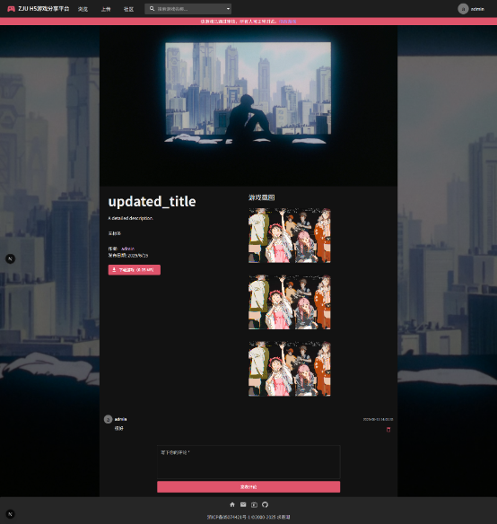

# h5game_platform




简单的 h5 在线游戏内容 CMS 分享平台 ，支持服务器部署，ZJU-SE 课程作业。

/site 文件夹为前端部分（包含管理平台），可以上传 h5 游戏包到服务器并生成展示页面；
/backend 为 python 潦草写的后端，以及数据库初始化 sql 文件。

项目使用 next.js，python fastapi，postgres 和 minio 形成四个容器，开销较大；
后续考虑使用 next.js server action，sqlite 和 minio 以精简代码，并将容器减少到两个。

## /site

This is a [Next.js](https://nextjs.org) project bootstrapped with [`create-next-app`](https://nextjs.org/docs/app/api-reference/cli/create-next-app).

### 目录结构

注意 `use client` 开头的是客户端组件

- hooks 是客户端组件可使用的异步 Hooks，以 use 开头。
- service 是服务端组件可使用的本地服务，直接从本地接口快捷获取数据并拼装 HTML 模版

尽量控制每个请求的 cache 以兼顾服务器渲染和缓存优化。

### Getting Started

安装依赖：

```
npm i
```

First, run the development server:

如果出现加载错误请删除 “.next” 文件夹重新构建。

```bash
npm run dev
# or
yarn dev
# or
pnpm dev
# or
bun dev
```

Open [http://localhost:3000](http://localhost:3000) with your browser to see the result.


## /backend

使用 python fastAPI 创建的后端。同时使用 minIO + PosgresSQL 创建数据库。

若需要单独调试后端，具体调试方法参见 /backend/README.md 。


## 部署

前后端数据库统一使用 docker 容器化部署，在初始版本中，一共有四个容器： Next.js ， Python FastAPI， PosgreSQL， MinIO。

在 windows 环境下，注意使用 `powershell 7` 版本，即 `$PSVersionTable.PSVersion` 应该显示 7 。

你可以直接用该命令启动所有容器：

```shell
deploy.ps1
```

在 linux 环境下 （支持 docker-compose v3），可以尝试使用该命令，直接在本机构建所有容器：

```bash
./deploy.sh true
```

若 linux 服务器不支持 image building ，先在本机运行上述命令后，拷贝根目录下的 `*.tar`，`.env`，`docker-compose.yml` 和 `deploy.sh` 到服务器上，运行部署命令：

```bash
chmod a+x deploy.sh
./deploy.sh
```

最后在 `nginx.conf` 中，映射 `PUBLIC_FRONT_URL` 到本机的 `FRONT_PORT`； `PUBLIC_BACK_URL` 到本机的 `BACK_PORT`； `PUBLIC_MINIO_URL` 到本机的 `MINIO_PORT` ，由于前端已经设置了 basePath，因此不需要截去 `/h5game` 前缀。 

```nginx
location ^~ /h5game/api/ {
                proxy_pass http://localhost:14399/;
                proxy_set_header Host $host;
}
location ^~ /h5game/assets/ {
                proxy_pass http://localhost:14400/;
                proxy_set_header Host $host;
}
location ^~ /h5game {
                proxy_pass http://localhost:14402;
                proxy_set_header Host $host;
}
```